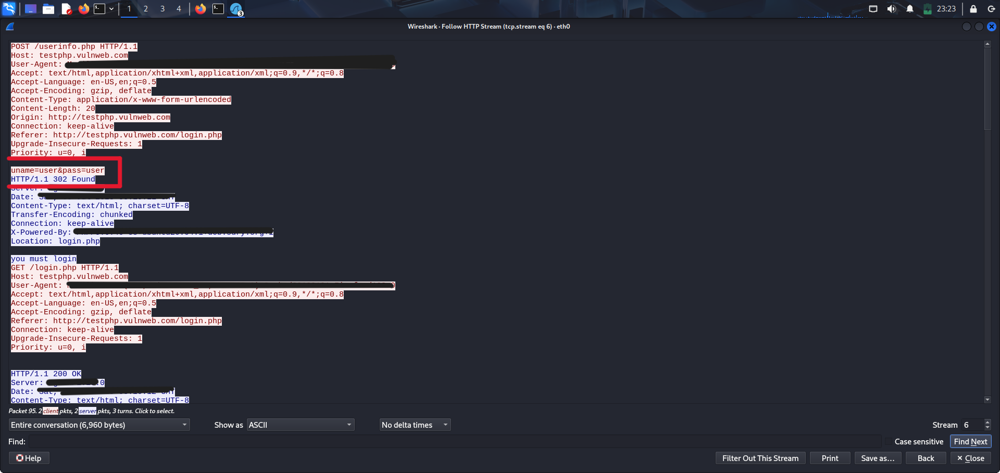

# 📡 Project 01 – Wireshark Sniffing

## 📝 Deskripsi
Simulasi serangan dan deteksi menggunakan Wireshark.
Dalam proyek ini, saya melakukan sniffing terhadap login form pada situs HTTP untuk melihat bagaimana data sensitif seperti username dan password dapat tertangkap saat tidak dienkripsi.

---

## 🎯 Tujuan
- Menganalisis paket jaringan dengan Wireshark
- Menemukan data login yang dikirim dalam format plaintext (tanpa enkripsi)
- Memahami risiko penggunaan HTTP

---

## 🛠️ Tools
- Kali Linux (di VirtualBox)
- Wireshark
- Browser (Firefox)
- Situs uji legal: [http://testphp.vulnweb.com/login.php](http://testphp.vulnweb.com/login.php)

---

## 📌 Langkah Praktik
1. Buka Wireshark di Kali Linux: 'sudo wireshark'
2. Pilih interface aktif (disini menggunakan 'eth0')
3. Kunjungi situs: 'http://testphp.vulnweb.com/login.php'
4. Login menggunakan:
   - Username: 'user'
   - Password: 'user'
5. Kembali ke Wireshark, filter dengan: http.request.method == "POST"
6. Klik kanan pada salah satu paket → Follow → HTTP Stream
7. Analisis isi paket, terlihat data: 'uname=user&pass=user'

---

## 🔍 Hasil & Analisis
- Terlihat data login dikirim dalam bentuk plaintext atau tidak terenkripsi.
- Ini menunjukkan HTTP tidak aman untuk transmisi data sensitif.
- Risiko nyata jika user menggunakan WiFi publik.

---

## 📷 Screenshot

---

## 💡 Insight
- Seluruh komunikasi sensitif sebaiknya dienkripsi (gunakan HTTPS).
- Sniffing dapat dilakukan dengan mudah di jaringan yang tidak aman.
- Pentingnya analisis traffic dalam SOC dan investigasi insiden.

---

## 📁 File Pendukung
- 'sniffing-result.png' – bukti hasil tangkapan paket POST
